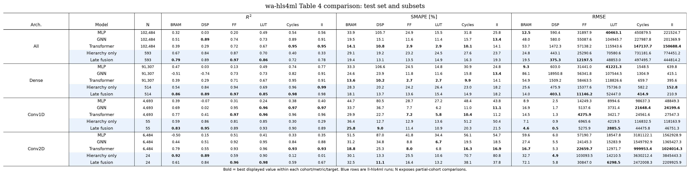
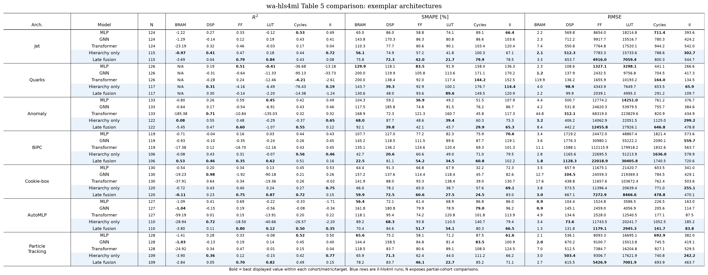

# wa-hls4ml paper comparison

This is an **additional** report generated from existing `predictions.csv` files;
the original run reports and metrics are unchanged.

## Inputs

- **Hierarchy only**: `/home/brend/projects/ll-hls4ml/artifacts/results/ll_hls4ml_hierarchy_fusion_scale200_results/hierarchical_scale200_seed42` (model `hierarchical`, seed 42, scale 200%)
- **Late fusion**: `/home/brend/projects/ll-hls4ml/artifacts/results/ll_hls4ml_hierarchy_fusion_scale200_results/hierarchical_high_level_fusion_scale200_seed42` (model `hierarchical_high_level_fusion`, seed 42, scale 200%)

Static baselines are transcribed from Tables 4 and
5 of [wa-hls4ml: A Benchmark and Surrogate Models for hls4ml Resource and Latency Estimation](https://arxiv.org/abs/2511.05615)
(arXiv:2511.05615v1). The editable transcription is
`src/ll_hls4ml/reporting/wahls4ml_paper_results.json`.

## Comparability boundary

The metric definitions are identical to the paper: per-target R², SMAPE with
`+1` in the denominator, and RMSE on original-scale absolute values. Cohorts are
also aligned: **All**, all five fully-connected families as **Dense**,
**Conv1D**, **Conv2D**, and the seven exemplar architectures.

The sample membership and training scale are not identical. The paper models
were trained on the full 478,220-sample training set and evaluated on all 102,484
synthetic test samples plus all 887 exemplars. The displayed ll-hls4ml runs use
their persisted prediction subsets. The `N` column must therefore accompany any
shared table; these are benchmark-context comparisons, not paired head-to-head
evaluations on identical samples.

## Exemplar identity audit

Every displayed exemplar prediction was joined losslessly by UUID to
`exemplar_models.json`, and its six ground-truth targets were checked against the
label record. Coverage is:

- **Hierarchy only**: 799/887 exemplars (Jet 115/124, Quarks 117/126, Anomaly 122/133, BiPC 106/119, Cookie-box 120/130, AutoMLP 110/127, Particle Tracking 109/128)
- **Late fusion**: 799/887 exemplars (Jet 115/124, Quarks 117/126, Anomaly 122/133, BiPC 106/119, Cookie-box 120/130, AutoMLP 110/127, Particle Tracking 109/128)

Missing exemplars were not assigned by name heuristics or silently included.

## Files

- `wahls4ml_comparison.csv`: tidy, machine-readable values and best-cell flags
- `wahls4ml_test_comparison.png`: paper-style Table 4 extension
- `wahls4ml_exemplar_comparison.png`: paper-style Table 5 extension
- `comparison_manifest.json`: input provenance and coverage
